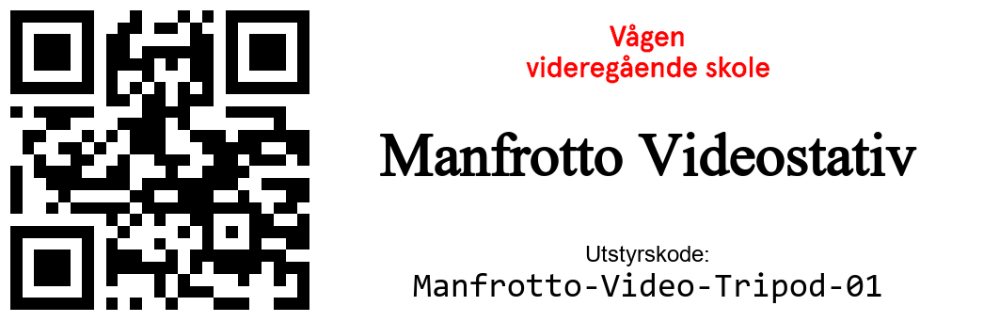
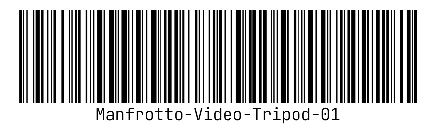

<div align="center">
<h1>Etikett Server for Vågen Utstyrsbase</h1>
Simple & hacky barcode and QR code label generator API for the Vågen Utstyrsbase.

Due for a refactor - it's all just hacked together for now.
<br>

Label dimensions: `16x54mm` (Could update this to work for other sizes as well, but for now it's hardcoded with spaghetti code.)
  



</div>

## Installation
1. Clone the repository
2. Run `pip install -r requirements.txt`
3. Download fonts from the links below, you might have to put them in the `src` folder
4. Configure `app.py` according to the [brother-ql](https://pypi.org/project/brother-ql/) package

Fonts: 
- https://fonts.google.com/specimen/Lato
- https://fonts.google.com/specimen/JetBrains+Mono

## Usage
Run with `python app.py` and go to `http://ip-address:5000/` in your browser to design and print labels. You can also integrate in your own application by using the API endpoints.

The application has an optional `category` selector which is currently not visible, but is used in audits.

## Endpoints
Endpoint schema:
```python
id = "A6500-01"
name = "Sony A6500"
variant = "qr"  # "qr" or "barcode", default: "qr"
category = "Camera"  # Optional, used for audits
```

### GET & POST `/preview`
Returns a preview of the label, useful for getting a preview of the label before printing.

### POST `/print`
Prints the label to the connected printer. (Requires setup of printer in `app.py`)

### GET `/audits`
Returns a JSON of every job successfully sent to the printer, every audit is timestamped.

### GET `/inventory`
Displays an interactibe datatable of the inventory, just in case you need a quick overview.
