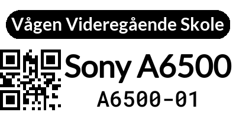
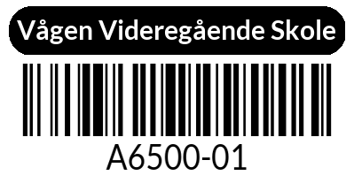

<div align="center">
<h1>Etikett Server for Vågen Utstyrsbase</h1>
Simple & hacky barcode and QR code label generator API for the Vågen Utstyrsbase.
<br>

Label dimensions: `50x26mm` Zebra Labels (Could update this to work for other sizes as well, but for now it's hardcoded with
spaghetti code.)




</div>

## Installation

1. Clone the repository
2. Ensure cups is installed and Zebra printer is working
3. Run `docker compose up -d`

## Usage

Visit `http://ip-address:5000/` in your browser to design and print labels. You can also integrate in your own application by using the API endpoints.

## Endpoints

### GET `/preview?id={id}&name={name}&variant={variant}&category={category}`

```python
id = "A6500-01"
name = "Sony A6500"
variant = "qr"  # "qr" or "barcode", default: "qr"
category = "Camera"  # Optional, used for audits
```

Returns a preview of the label, useful for getting a preview of the label before printing.

### POST `/print` (JSON)

```json
{
  "id": "A6500-01",
  "name": "Sony A6500",
  "variant": "qr",
  "category": "Camera",
  "count": 1
}
```

Prints the label to the connected printer. (Requires setup of printer in `app.py`)
