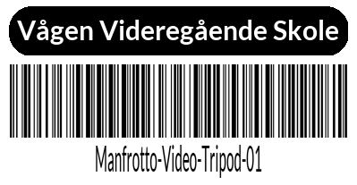

<div align="center">
<h1>Etikett Server for Vågen Utstyrsbase</h1>
Simple barcode and QR code label generator API for the Vågen Utstyrsbase.
<br>

Label dimensions: `29x90mm`




</div>

## Installation
1. Clone the repository
2. Run `pip install -r requirements.txt`

Used fonts: 
- https://fonts.google.com/specimen/Lato
- https://fonts.google.com/specimen/JetBrains+Mono

## Usage
Run with `python app.py` and go to `http://localhost:5000/` in your browser to design and print labels. You can also integrate in your own application by using the API endpoints.

## Endpoints
The following parameters is used by every endpoint:
```python
id = "A6500-01"
name = "Sony A6500"
variant = "qr"  # "qr" or "barcode", default: "qr"
```

### GET & POST `/preview`
Returns a preview of the label, useful for getting a preview of the label before printing.

### POST `/print`
Prints the label to the connected printer. (Requires setup of printer in `app.py`)

Adds the `count` parameter, which specifies how many labels to print. Default: `1`
```python
count = 2  # Print 2 labels, default: 1
```

## TODO
`app.py` add connection to brother printers
